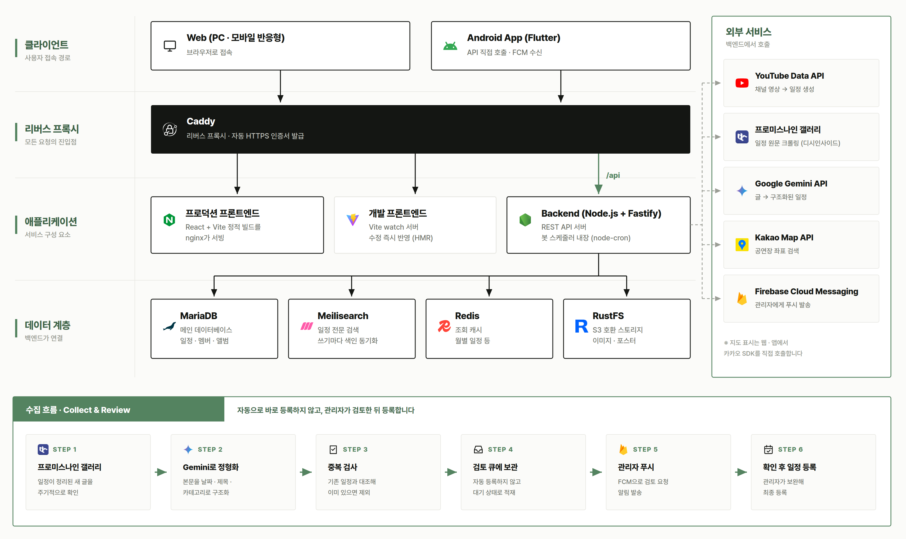

# 🌸 프롬로그 (fromlog) — fromis_9 팬 아카이브

프로미스나인(fromis_9) 팬사이트입니다. PC/모바일 분기, 멤버·디스코그래피·일정·영상 아카이브, YouTube/X 자동 수집 봇, 검색, Flutter 앱(푸시 알림)까지 포함한 풀스택 서비스입니다.


---

## ✨ 주요 기능

- 👥 **멤버 소개** - 프로미스나인 멤버 프로필 및 상세 정보
- 💿 **디스코그래피** - 앨범, 트랙(가사/작사·작곡), 컨셉 포토, 티저 갤러리
- 📅 **스케줄** - 일정 캘린더, 카테고리 필터, 콘서트·팬사인회·티켓팅·행사·기타 등 카테고리별 전용 상세
- 🎬 **영상 아카이브** - 본채널·스프·예능·직캠을 채널별로 모아보기, 직캠 멤버 필터·월별 구분
- 🎂 **기념일** - 멤버 생일 및 데뷔/주년 축하 효과(confetti)
- 🔎 **검색** - Meilisearch 기반 일정 검색 + 초성/형태소 추천 검색어
- 🤖 **자동 수집 봇** - YouTube / X(Twitter) 일정 자동 동기화 + 커뮤니티 글을 LLM으로 정형화하는 일정 수집 봇
- 📥 **수집 큐** - 봇이 찾은 신규 일정을 자동 등록 대신 검토 큐에 쌓고, 관리자 푸시 → 확인 후 등록
- 🛠️ **관리자 페이지** - 멤버·앨범·일정·봇·수집 큐 관리, 활동 로그 조회
- 📱 **PC / 모바일 분기** - 디바이스별 전용 페이지·레이아웃 제공
- 📲 **Flutter 앱** - 웹과 동일한 화면 구성, Otto OTA 자가 업데이트
- 🔔 **푸시 알림(FCM)** - 봇 정지·세션 만료 등 운영 알림을 원인·조치와 함께 발송

---

## 🏗 시스템 구조



| 구성 | 역할 |
| --- | --- |
| **Caddy** | 리버스 프록시 · 자동 HTTPS. prod/dev 도메인을 각 컨테이너로 분기 |
| **frontend-prod / frontend(dev)** | 같은 소스를 정적 빌드(nginx) / Vite watch 두 갈래로 서빙 |
| **backend (Fastify)** | REST API + 봇 스케줄러(node-cron)를 한 프로세스에서 운영 |
| **MariaDB** | 일정·멤버·앨범·영상 등 도메인 데이터 (다른 서비스와 공유하는 인스턴스) |
| **Meilisearch** | 일정 전문 검색 색인 (쓰기 시점마다 동기화) |
| **Redis** | 월별 일정 등 조회 캐시 |
| **RustFS (S3 호환)** | 이미지·포스터 원본/리사이즈본 저장 |
| **Flutter 앱** | 웹과 동일 화면 + FCM 수신, Otto로 인앱 자가 업데이트 |

### 일정 수집 파이프라인

봇은 **채널별 자동 등록**과 **검토 후 등록** 두 갈래로 나뉩니다.

```
YouTube/X 봇   ──▶ 채널·계정 단위 수집 ──▶ 일정 자동 생성
커뮤니티 수집 봇 ──▶ 게시글 본문 크롤 ──▶ Gemini로 정형화·분류·중복판단
                                        └─▶ 수집 큐(검토 대기) ──▶ 관리자 푸시(FCM)
                                                                 └─▶ 확인·보완 후 등록
```

- 게시글은 글 단위로 처리 이력을 남겨 **같은 글을 다시 분석하지 않습니다**(LLM 호출 절약).
- 이미 있는 일정과 대조해 중복을 걸러내고, **유튜브 콘텐츠는 전용 봇이 담당**하므로 큐에서 제외합니다.
- 날짜가 아직 안 잡힌 일정도 큐에 담아 두고, 다음 수집 때 날짜가 정해지면 **기존 항목을 갱신**합니다.

---

## 📁 프로젝트 구조

```
fromlog/
├── frontend/                 # React 18 + Vite 프론트엔드
│   └── src/
│       ├── api/              # API 클라이언트 (public / admin)
│       ├── components/       # 공통 / pc / mobile 컴포넌트
│       ├── pages/            # pc(public·admin) / mobile 페이지
│       ├── routes/           # 라우트 정의 (pc·mobile 분기)
│       ├── hooks/            # 커스텀 훅
│       ├── stores/           # Zustand 스토어
│       ├── utils/            # 유틸리티
│       └── App.jsx           # PC/모바일 분기 진입
│
├── backend/                  # Fastify 5 백엔드
│   └── src/
│       ├── plugins/          # db / redis / auth / meilisearch / scheduler
│       ├── routes/           # auth, members, albums, schedules, videos, push, stats, admin
│       ├── services/         # youtube · x · festival(일정 수집 봇) · meilisearch · image · videos · push
│       ├── schemas/          # 요청/응답 스키마
│       ├── config/           # 환경변수 통합 관리
│       ├── utils/            # cache / log / transaction 등
│       ├── app.js            # Fastify 앱 설정
│       └── server.js         # 진입점
│
├── app/                      # Flutter 안드로이드 앱 (Otto OTA 배포)
│   └── lib/
│       ├── models/           # 데이터 모델
│       ├── views/            # 화면 (홈·멤버·앨범·일정)
│       ├── services/         # API 클라이언트 · 푸시(FCM) · 다운로드
│       ├── core/             # 라우터 · 상수 · 팔레트 · 포맷 유틸
│       └── update/           # 인앱 자가 업데이트(SplashGate)
│
├── docs/                     # architecture · api · development · logs 문서
└── docker-compose.yml        # frontend(dev) / frontend-prod / backend / meilisearch / redis
```

---

## 🛠️ 기술 스택

### Frontend

| 기술                       | 설명                       |
| -------------------------- | -------------------------- |
| **React 18**               | UI 라이브러리              |
| **Vite 5**                 | 빌드 도구 / 개발 서버      |
| **TailwindCSS 3**          | CSS 프레임워크             |
| **Zustand 5**              | 전역 상태 관리             |
| **TanStack React Query 5** | 서버 상태 / 데이터 패칭    |
| **React Router 6**         | 라우팅                     |
| **framer-motion**          | 애니메이션                 |
| **@dnd-kit**               | 드래그 앤 드롭             |
| **Swiper**                 | 슬라이드 / 갤러리          |
| **react-device-detect**    | PC / 모바일 분기           |

### Backend

| 기술                  | 설명                                 |
| --------------------- | ------------------------------------ |
| **Node.js 20**        | 런타임 환경                          |
| **Fastify 5**         | 웹 프레임워크                        |
| **MySQL2**            | MariaDB 연동                         |
| **Meilisearch**       | 전문 검색 엔진                       |
| **ioredis (Redis 7)** | 캐싱                                 |
| **@fastify/jwt**      | JWT 인증                             |
| **AWS SDK S3**        | 이미지 스토리지 (RustFS S3 호환)     |
| **sharp**             | 이미지 리사이즈/변환                 |
| **node-cron**         | 봇 스케줄러                          |
| **bcrypt**            | 비밀번호 해시                        |
| **kiwi-nlp / inko**   | 형태소·초성 추천 검색어              |
| **firebase-admin**    | FCM 푸시 알림 발송                   |
| **@fastify/swagger + Scalar** | API 문서                     |

### App (Flutter)

| 기술                     | 설명                          |
| ------------------------ | ----------------------------- |
| **Flutter 3**            | 안드로이드 앱                 |
| **Riverpod**             | 상태 관리                     |
| **firebase_messaging**   | 푸시 알림 수신                |
| **kakao_map_sdk**        | 네이티브 지도                 |
| **ota_update**           | 인앱 자가 업데이트 (Otto)     |

---

## 🚀 개발 & 실행

### Docker (권장)

```bash
docker compose up -d --build   # 전체 실행 (frontend/dev + frontend-prod + backend + meilisearch + redis)
docker compose logs -f         # 로그 확인
docker compose down            # 중지
```

> `frontend`(Vite)와 `backend`(`node --watch`)는 워치 모드로 동작합니다.

**프로덕션 / 개발 병행 서빙**

| 도메인 | 컨테이너 | 내용 |
| --- | --- | --- |
| `fromlog.caadiq.co.kr` | `fromlog-frontend-prod` | `vite build` 결과물을 nginx로 정적 서빙 |
| `dev.fromlog.caadiq.co.kr` | `fromlog-frontend` | Vite watch — 수정 즉시 반영 |

프론트 수정은 dev 도메인에서 확인한 뒤, 아래 한 줄로 프로덕션에 반영합니다.

```bash
docker compose up -d --build fromlog-frontend-prod
```

### 앱 (Flutter)

```bash
cd app && otto-publish "변경사항"   # 빌드 + Otto 업로드 → 폰에서 자가 업데이트
```

### 로컬 개발 모드

```bash
# 프론트엔드
cd frontend && npm install && npm run dev

# 백엔드
cd backend && npm install && npm run dev
```

### 환경 변수

`.env` 파일에 설정합니다 (주요 항목):

```env
# DB (MariaDB)
DB_HOST=mariadb
DB_USER=fromlog
DB_PASSWORD=your_password
DB_NAME=fromlog

# 인증 / 검색 / 캐시
JWT_SECRET=...
MEILI_MASTER_KEY=...
REDIS_HOST=fromlog-redis

# S3 호환 스토리지 (RustFS)
RUSTFS_ENDPOINT=...
RUSTFS_ACCESS_KEY=...
RUSTFS_SECRET_KEY=...
RUSTFS_BUCKET=...
RUSTFS_PUBLIC_URL=...

# 외부 API
GOOGLE_API_KEY=...   # YouTube Data API
GEMINI_API_KEY=...   # 일정 수집 봇(게시글 정형화)
KAKAO_REST_KEY=...   # 카카오맵 장소 검색

# 푸시 알림 (FCM)
PUSH_ADMIN_KEY=...      # 앱이 운영 알림 수신 기기로 등록할 때 사용
PUSH_INTERNAL_KEY=...   # 내부 스크립트가 알림 발송 시 사용
```

> FCM 키 파일 2개는 **git에 포함되지 않습니다**.
> - `app/android/app/google-services.json` (앱)
> - `backend/firebase-service-account.json` (서버 발송용)

자세한 내용은 [`docs/`](docs/) 폴더(architecture.md, api.md, development.md, logs.md)를 참고하세요.

---

## 🌐 접속

- **서비스**: https://fromlog.caadiq.co.kr
- **개발 서버**: https://dev.fromlog.caadiq.co.kr
- **앱**: Otto(`otto.caadiq.co.kr`)를 통해 배포 — 인앱 자가 업데이트

---

## 📄 라이선스

[MIT License](LICENSE)
