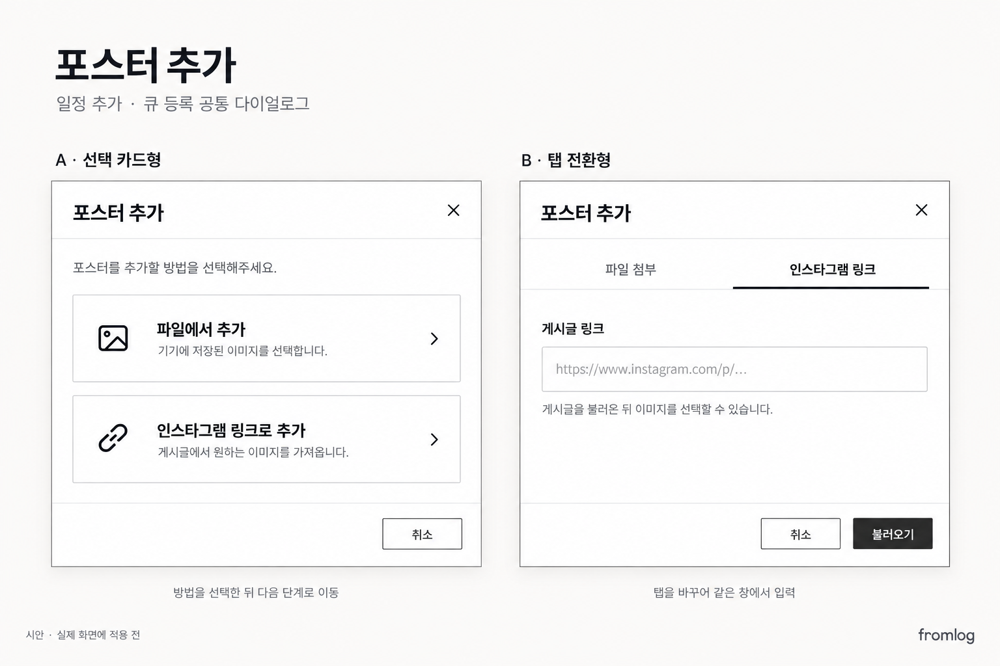

# 포스터 추가 다이얼로그 확정안

- 확정일: 2026-09-23
- 상태: 설계 확정, 구현 대기. 사용자가 나중에 작업하도록 저장을 요청함.
- 방향: 인스타그램 링크는 사용자가 직접 찾고, 링크에서 게시물 이미지를 가져와 포스터로 선택한다. Gemini 등 AI API는 이 기능에 사용하지 않는다.

## 적용 범위

- 일정 추가 페이지의 포스터 추가
- 큐에서 일정 등록하는 화면의 포스터 추가
- 두 화면은 같은 다이얼로그와 동작을 공유한다.
- 기존 일정 수정 화면으로의 확대는 이번 확정 범위에 포함하지 않는다.

## 선택한 시안: B 탭 전환형

이미지의 오른쪽 B안을 선택했다. A안은 방법 선택 때문에 한 단계가 추가되어 채택하지 않았다. 이미지는 초기 시안이며, 아래 버튼 동작이 최종 기준이다.

- 기존 포스터 추가 클릭 시 파일 선택기를 바로 열지 않고 다이얼로그를 연다.
- 탭: `파일 첨부` / `인스타그램 링크`
- 파일 탭: 기기의 파일 선택 및 드래그해서 놓기. 기존 파일 첨부 기능 유지.
- 링크 탭: 게시글 주소 입력 후 하단 버튼으로 불러오기.
- 일정에 인스타그램 주소가 이미 입력돼 있으면 링크 탭에 미리 채워서 연다.
- 이미지 목록은 링크 입력칸 아래 같은 다이얼로그 안에 격자로 표시한다. 별도 창이나 추가 선택 단계로 이동하지 않는다.
- 여러 이미지 선택 가능. 이미지가 많으면 목록 영역을 스크롤한다.
- 취소 버튼과 닫기 제공. 기존 관리자 화면의 사각형·얇은 테두리·검정 버튼 스타일 유지.

## 하단 주요 버튼: 최종 합의

| 상태 | 버튼 | 클릭 시 동작 |
| --- | --- | --- |
| 링크 입력, 이미지 불러오기 전 | 불러오기 | 게시글 이미지 가져오기 |
| 이미지가 표시됐지만 선택 0장 | **불러오기 유지** | 현재 링크에서 다시 불러오기 |
| 이미지 1장 이상 선택 | 추가하기 · N장 | 선택한 이미지를 부모 폼의 포스터 목록에 반영하고 다이얼로그 닫기 |
| 선택을 모두 해제 | **불러오기로 복귀** | 현재 링크에서 다시 불러오기 |

**선택 전 버튼을 비활성 `추가하기`로 바꾸지 않는다.** 사용자가 그 방식을 명시적으로 수정했다. 이미지 로딩 완료 여부가 아니라 선택 개수가 버튼을 결정한다.

- 링크 수정 시 가져온 이미지와 선택을 초기화하고 `불러오기`로 복귀한다.
- 로딩 중 중복 실행 방지, 빈 링크 및 오류 표시는 구현 시 처리한다.
- 다이얼로그의 `추가하기`는 부모 폼에 첨부하는 동작이다. 일정 자체를 즉시 등록하지 않는다.
- 선택 결과는 파일 첨부와 같은 포스터 목록에서 삭제·순서 변경할 수 있도록 한다.
- 일정 저장 시 사이트 저장소에 저장해 첨부한다. 인스타그램 CDN 주소를 영구 포스터 주소로 저장하지 않는다.
- 게시물 이미지 추출 실패 시 안내하고 파일 첨부를 사용할 수 있게 한다.

## 조사 결과 및 후속 작업 참고

- 인하대 게시물에서 embed 응답의 `contextJSON`을 파싱해 이미지 6장 다운로드를 검증했다. 모든 게시물에서 성공한다고 보장할 수는 없다.
- 건국대 `https://www.instagram.com/p/DdVjOk-k4bd/`의 embed에서 계정 `festival.konkuk`, 2026 일감연 본문과 이미지 4장을 확인했다. 이 게시물 이미지 다운로드 전체를 검증한 것은 아니다.
- Gemini 2.5 Flash 검색으로 큐 대학 5곳을 묶어 두 차례 각각 1회 테스트했다. 첫 번째는 개별 인스타 링크 0건, 두 번째는 블립을 경유한 건국대 링크 1건. 검색 자동화 대신 사용자가 링크를 입력하는 방향을 선택했다.
- API 호출·이미지 분석은 이 설계 저장 작업에서 추가 실행하지 않았다.
- 이후 구현 시 인스타 URL 검증, 외부 요청 대상 제한, 이미지 형식·크기·개수 제한, 실패 처리와 기존 업로드 경로를 확인한다.
- 관련 시작점: `frontend/src/pages/pc/admin/schedules/ScheduleQueue.jsx`, 일정 추가 폼의 포스터 입력, `backend/src/routes/admin/pending.js` 및 기존 이미지 업로드 경로.

시안은 내장 이미지 생성 도구로 생성했다. 생성 요청 요약: 기존 fromlog 관리자 색상·사각 테두리·검정 버튼을 유지하는 한국어 고해상도 UI 시안, A 선택 카드형과 B 탭 전환형을 비교하고 B에 파일/인스타 탭·주소 입력·취소/불러오기 버튼 배치.
